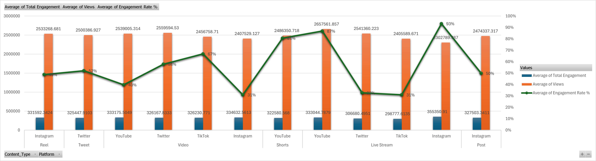

# RusselDayao_PorfolioProject
TrendSpark Media, founded in 2016, is a digital marketing agency specializing in viral content optimization and influencer strategy. It partners with brands to scale their online presence through data-driven campaigns across top platforms, including TikTok, Instagram, Twitter, and YouTube.

As a data analyst embedded within the performance insights team, I audited over 5,000 viral social media posts to understand engagement behavior across formats and regions. While TrendSpark collects significant data across its campaigns, this engagement data has not yet been deeply leveraged to optimize platform-specific strategies or content creation.

This project analyzes and visualizes those trends using Excel to uncover critical insights to enhance content planning, influencer partnerships, and campaign ROI.

 Insights and recommendations are provided on the following key areas:
### • Content Type Performance
Comparing the performance of different content types (Reels, Shorts, Tweets, Posts, etc.) across platforms to identify high-performing formats.  
### • Platform Effectiveness
Measuring which platforms drive the most engagement relative to views and content type.
### • Hashtag Impact
Analyzing the role that trending hashtags play in driving virality and interaction rates.

PLACE FOR LINKS OF MY PROJECT.

## Data Structure & Initial Checks
To ensure a reliable foundation for the analysis, preliminary quality checks and data familiarization steps were carried out using Excel. This included checking for missing values, inconsistent platform naming, duplicate post IDs, and abnormal engagement metrics.

## Executive Summary
### Overview of findings
The analysis shows that YouTube Live Streams achieve the highest engagement rate at 87%, despite similar view counts across platforms. Instagram Live Streams and TikTok Live Streams have the lowest engagement rates, around 30–31%, suggesting lower audience interaction during live content on these platforms. TikTok videos and YouTube Shorts also stand out with relatively high engagement rates (67% and 81%, respectively). Overall, live content on YouTube and short-form videos on TikTok and YouTube are the most effective formats for driving user engagement.

